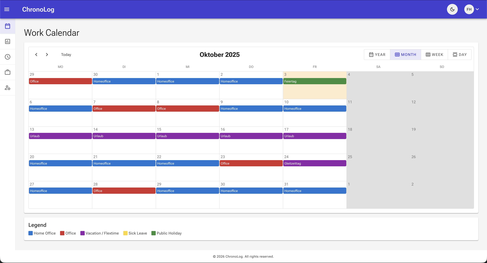
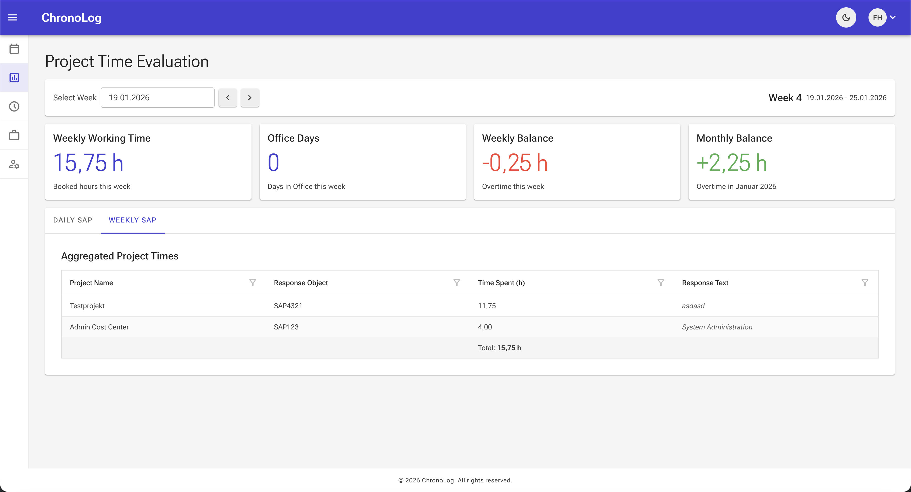
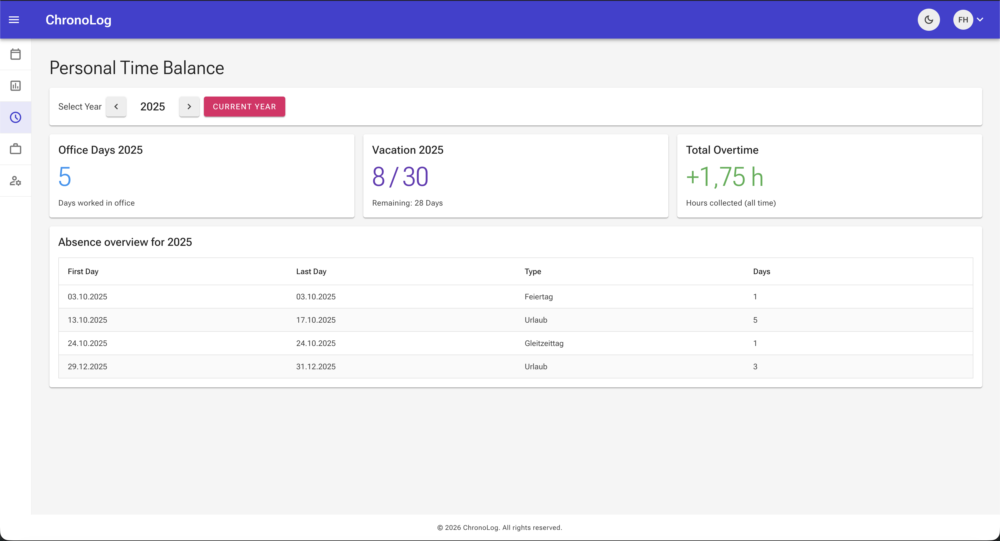

# ChronoLog - Worktime Tracking Application

[](https://github.com/fheinke/ChronoLog/pkgs/container/chronolog)
[](LICENSE.txt)

ChronoLog is a modern, efficient worktime tracking application built with **ASP.NET Core** and **Blazor Server**. Designed for individuals and teams, ChronoLog helps you monitor productivity, manage time effectively, and streamline reporting processes. Track your work hours, manage projects, and copy the worktime data directly to enterprise systems like SAP to book your times.



## ✨ Features

- **⏱️ Time Tracking**: Log work hours
- **📊 Project Management**: Organize work by projects with detailed time allocation
- **📈 Reporting & Analytics**: Generate comprehensive reports with copy-to-clipboard functionality for SAP integration
- **🎯 Personal Dashboard**: View overtime balance, vacation days, and time statistics at a glance
- **🔒 Flexible Authentication**: Secure login via **Microsoft Entra ID (Azure AD)** or **Keycloak** — configurable per deployment
- **👥 User Management**: Admin interface for managing permissions of employees
- **🏢 Multi-Province Support**: Configure workday types and holidays per region
- **🐳 Dockerized Deployment**: Simple deployment using Docker and Docker Compose
- **🌐 RESTful API**: Full API support for external integrations
- **📱 Responsive Design**: Modern UI that works seamlessly on desktops




## 🏗️ Technology Stack

- **Backend**: ASP.NET Core 10 (.NET 10)
- **Frontend**: Blazor Server with Radzen UI Components
- **Database**: MySQL 8 with Entity Framework Core
- **Authentication**: Microsoft Entra ID (Azure AD) **or** Keycloak — via OpenID Connect
- **API Documentation**: Swagger/OpenAPI
- **Containerization**: Docker & Docker Compose

## 🚀 Quick Start

### Prerequisites

- Docker and Docker Compose installed on your machine
- **One** of the following authentication providers:
  - **Microsoft Entra ID (Azure AD)**: An Azure account with permissions to create App Registrations
  - **Keycloak**: A running Keycloak instance (≥ 26) with a configured realm and client
- (Optional) A reverse proxy like nginx for production deployment

### Installation

For detailed installation instructions, please see the [Getting Started Guide](docs/getting-started.md).

**Quick installation steps:**

1. Clone the repository
2. Configure your authentication provider — Azure AD **or** Keycloak (see [Getting Started Guide](docs/getting-started.md))
3. Copy `.env.example` to `.env` and configure your environment variables
4. Run `docker compose up -d`
5. Access the application at `http://localhost:8080`
6. Set the first admin user after initial login

For detailed configuration options, see [Configuration Guide](docs/configuration.md).

## 📚 Documentation

- **[Getting Started Guide](docs/getting-started.md)** - Step-by-step installation and setup
- **[Configuration Guide](docs/configuration.md)** - Detailed configuration options and best practices
- **[API Reference](docs/api-reference.md)** - Complete API documentation for integrations

## 🔧 Configuration Overview

ChronoLog uses environment variables for configuration. Set `AUTH_PROVIDER` to `AzureAd` or `Keycloak` to select your authentication provider:

```bash
# Authentication Provider ("AzureAd" or "Keycloak")
AUTH_PROVIDER=AzureAd

# --- Option A: Azure AD ---
AZURE_AD_DOMAIN=yourdomain.onmicrosoft.com
AZURE_AD_TENANT_ID=your-tenant-id
AZURE_AD_CLIENT_ID=your-client-id
AZURE_AD_CLIENT_SECRET=your-client-secret

# --- Option B: Keycloak ---
# KEYCLOAK_AUTHORITY=https://keycloak.example.com/realms/your-realm
# KEYCLOAK_CLIENT_ID=chronolog
# KEYCLOAK_CLIENT_SECRET=your-client-secret

# Database Configuration
MYSQL_HOST=chronoLogDatabase
MYSQL_USER=chronolog
MYSQL_PASSWORD=your-secure-password
MYSQL_DATABASE=ChronoLog

# Reverse Proxy (for production)
REVERSE_PROXY_ENABLED=true
REVERSE_PROXY_BASE_URL=https://chronolog.yourdomain.com
REVERSE_PROXY_KNOWN_PROXIES="172.16.0.0/12"
```

See the [Configuration Guide](docs/configuration.md) for all available options.

## 🔐 Security

- All API endpoints require authentication
- Role-based authorization for admin and project management features
- Supports **Microsoft Entra ID** and **Keycloak** via OpenID Connect — only one provider active at a time
- Secure cookie handling with SameSite and HttpOnly flags
- HTTPS enforcement in production environments
- Database migrations run automatically on startup
- Health checks for service monitoring

## 📄 License

This project is licensed under the terms specified in [LICENSE.txt](LICENSE.txt).
Feel free to use, modify, and distribute it as per the license terms.